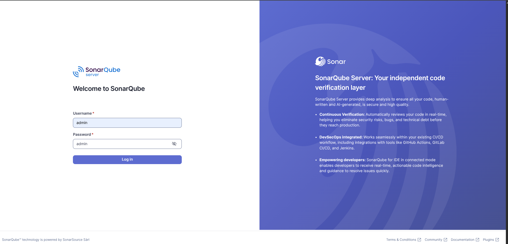
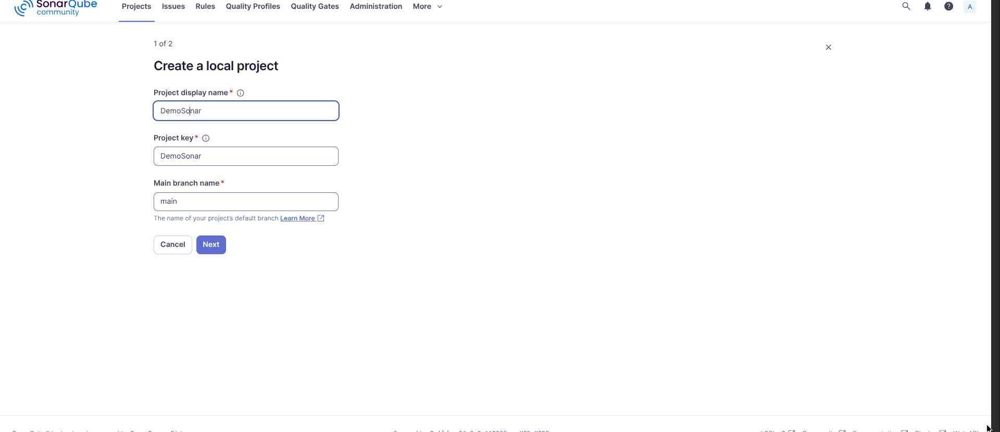
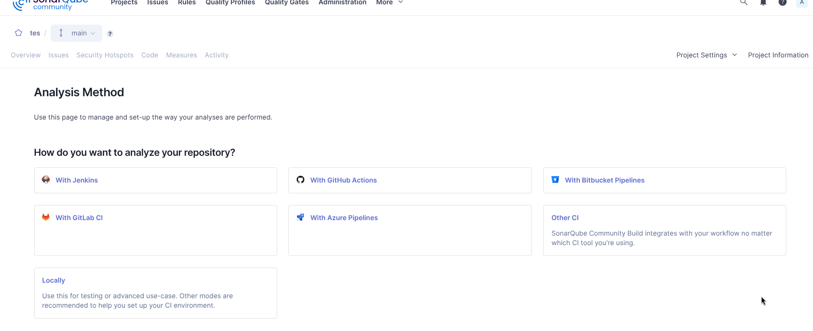
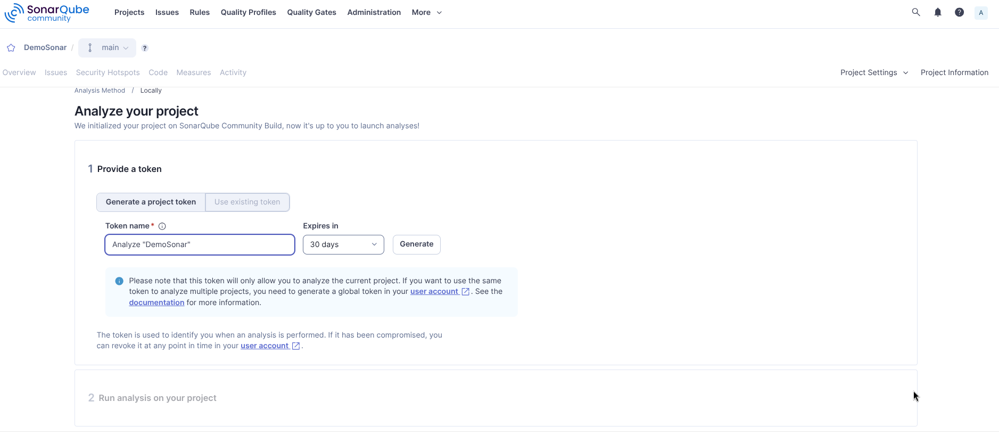
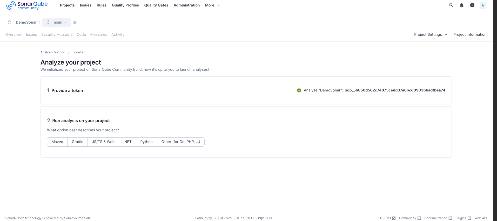
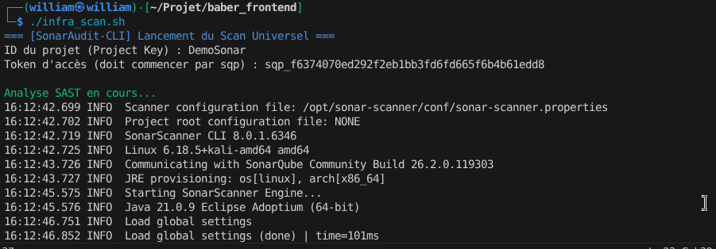
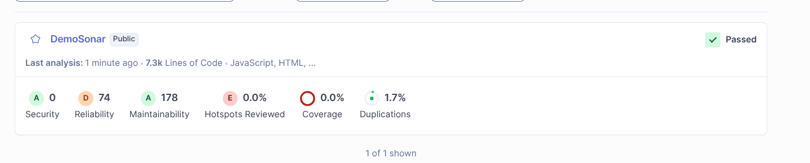

# SonarAudit-CLI 🔍


**Scanner de Code Semi-Automatique avec SonarQube en Local**

## 📋 Description

SonarAudit-CLI est un outil d'analyse statique de code qui utilise SonarQube en local via Docker. Il permet d'effectuer des audits de sécurité et de qualité de code de manière simple et automatisée pour vos projets JavaScript, Python, C, et bien d'autres langages.

L'outil se compose de deux scripts Bash qui automatisent le déploiement de l'infrastructure SonarQube et l'exécution des scans de code.

## ✨ Fonctionnalités

- 🐳 Déploiement automatique de SonarQube via Docker
- 🔍 Analyse statique multi-langages (JavaScript, Python, C, Java, etc.)
- 📊 Rapports de qualité de code détaillés
- 🔐 Détection des vulnérabilités de sécurité
- ⚡ Configuration simple en 2 étapes
- 🎯 Interface web accessible localement

## 🛠️ Technologies utilisées

- SonarQube Community Edition
- Docker
- Bash
- SonarScanner

## 📦 Installation

### Prérequis

Assurez-vous d'avoir installé les outils suivants :

**Docker**

```bash
# Installation sur Debian/Ubuntu
sudo apt update
sudo apt install docker.io
sudo systemctl start docker
sudo systemctl enable docker
```

**Curl**

```bash
sudo apt install curl
```

### Récupération des scripts

• Cloner le repository

```bash
git clone https://github.com/williamWilliam10/SonarAudit-CLI.git
cd SonarAudit-CLI
```

• Donner les permissions d'exécution

```bash
chmod +x start_infra.sh
chmod +x infra_scan.sh
```

## 🚀 Utilisation

### ÉTAPE 1 : Démarrage de l'infrastructure

Lancez le script de démarrage de l'infrastructure SonarQube :

```bash
./start_infra.sh
```

Ce script va :
- Télécharger et lancer un conteneur Docker SonarQube
- Exposer l'interface web sur le port 9000
- Attendre que les services soient complètement démarrés

Une fois terminé, vous verrez le message :

```
INFRASTRUCTURE PRÊTE : http://localhost:9000
```

---

### ÉTAPE 2 : Configuration de SonarQube

#### 2.1 - Connexion initiale

• Ouvrez votre navigateur et accédez à `http://localhost:9000`

• Connectez-vous avec les identifiants par défaut :
- **Login** : `admin`
- **Password** : `admin`



#### 2.2 - Changement du mot de passe

• SonarQube vous demandera de changer le mot de passe


#### 2.3 - Création d'un projet

• Cliquez sur **"Create Project"** ou **"Créer un projet"**

• Remplissez les informations du projet :
- **Display name** : `Mon Projet` (nom affiché)



• Méthode d'analyse : Choisissez **"Locally"**



#### 2.4 - Génération du token

• Dans la section **"Provide a token"**, entrez un nom pour votre token (ex: `mon-token`)



• Cliquez sur **"Generate"**

• **IMPORTANT** : Copiez et sauvegardez le token généré (vous ne pourrez plus le voir après)

#### 2.5 - Sélection du langage

• Choisissez le langage principal de votre projet :
- JavaScript / TypeScript
- Python
- C / C++ / Objective-C
- Java
- C#
- Autres



• Cliquez sur **"Continue"**

---

### ÉTAPE 3 : Lancement du scan

• Copiez le fichier `infra_scan.sh` à la racine du projet à auditer

```bash
cp infra_scan.sh /chemin/vers/votre/projet/
cd /chemin/vers/votre/projet/
```

• Lancez le scan

```bash
./infra_scan.sh
```

Le script vous demandera les informations suivantes :



---

### ÉTAPE 4 : Consultation des résultats

• À la fin du scan, un lien sera affiché dans le terminal :

```
=== Analyse terminée ===
Résultats disponibles : http://localhost:9000/dashboard?id=mon-projet
```

• Cliquez sur le lien ou copiez-le dans votre navigateur pour consulter les résultats détaillés



## 📂 Structure du projet

```
SonarAudit-CLI/
├── start_infra.sh       # Script de démarrage de l'infrastructure
├── infra_scan.sh        # Script de scan du code
├── docs/
│   └── images/          # Captures d'écran pour le README
└── README.md
```

## 🔍 Détails techniques

### Script start_infra.sh

- Lance un conteneur Docker SonarQube Community
- Configure le port 9000 pour l'interface web
- Désactive les checks Elasticsearch pour simplifier l'utilisation en local
- Attend que les services soient complètement démarrés avant de terminer

### Script infra_scan.sh

- Utilise SonarScanner pour analyser le code source
- Envoie les résultats au serveur SonarQube local
- Génère un rapport détaillé accessible via l'interface web

## 🛑 Arrêt de l'infrastructure

Pour arrêter le conteneur SonarQube :

```bash
docker stop Sonariaudit_engine
```

Pour le supprimer complètement :

```bash
docker rm Sonariaudit_engine
```

Pour redémarrer un conteneur existant :

```bash
docker start Sonariaudit_engine
```

## 🐛 Problèmes courants

### Le port 9000 est déjà utilisé

Si vous avez une erreur indiquant que le port 9000 est déjà utilisé :

```bash
# Trouvez le processus utilisant le port
sudo lsof -i :9000

# Ou changez le port dans start_infra.sh
-p 9001:9000  # Utilisera le port 9001 à la place
```

### SonarQube ne démarre pas

Vérifiez les logs du conteneur :

```bash
docker logs Sonariaudit_engine
```

Assurez-vous d'avoir au moins 2 GB de RAM disponibles pour Docker.

## 👥 Auteur

- **William Lowe** - [lowewilliam.com](https://lowewilliam.com)

## 📄 License

Ce projet est sous licence MIT. Voir le fichier [LICENSE](LICENSE) pour plus de détails.

⭐️ Si cet outil vous a aidé, n'hésitez pas à lui donner une étoile !
